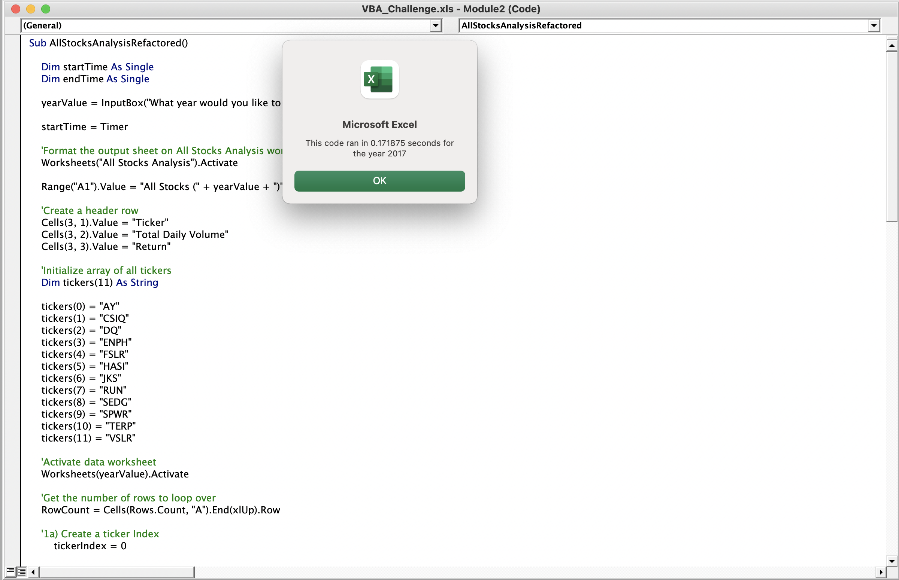
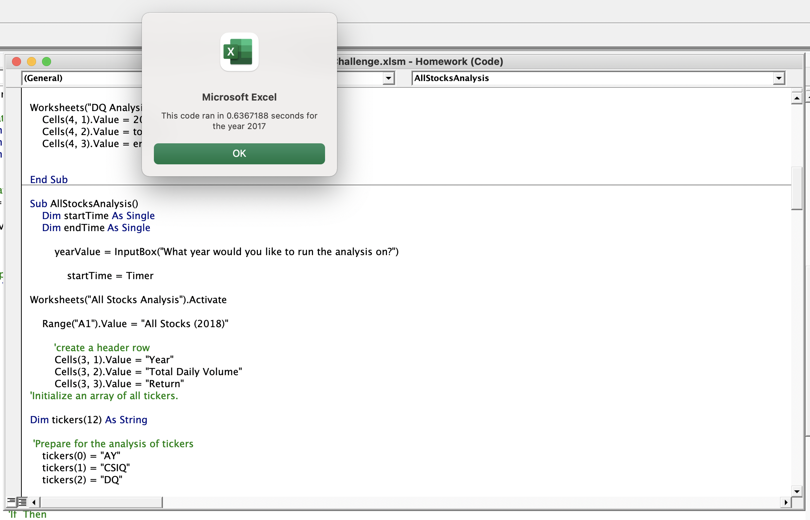
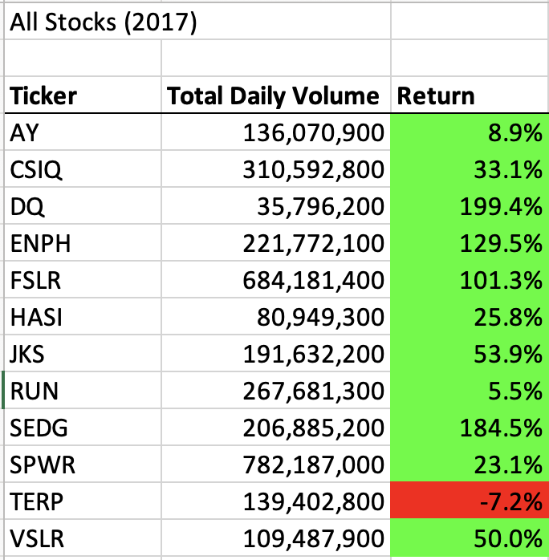
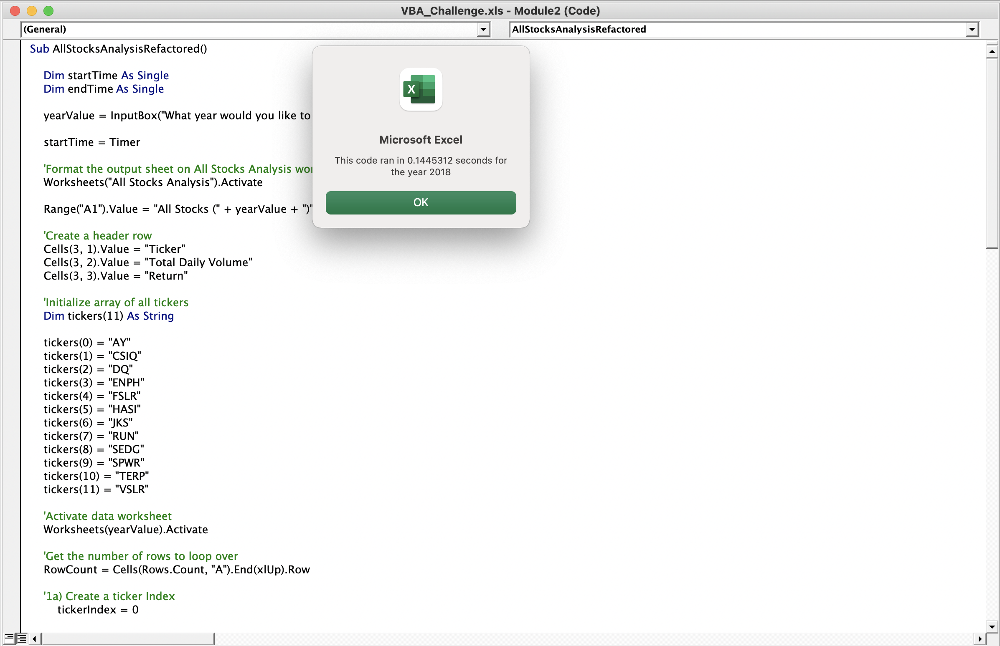
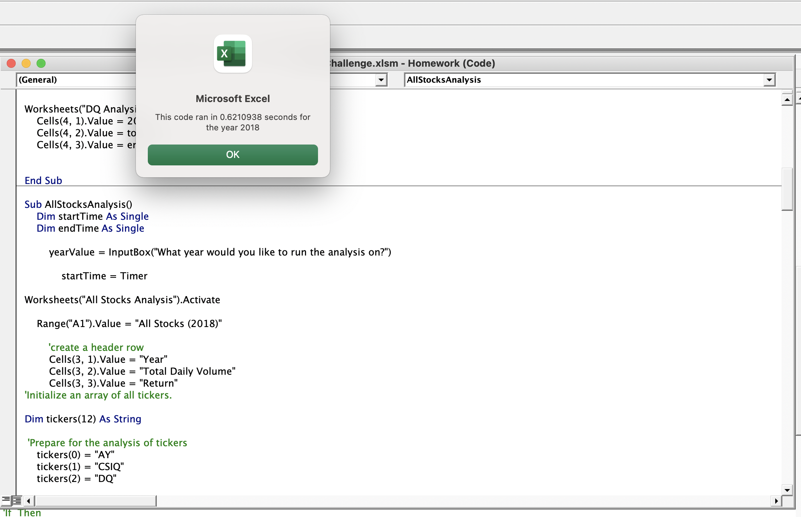
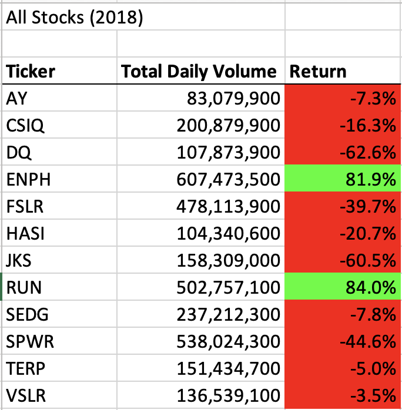

# stock-analysis Module 2 
## Overview
I am helping Steve analyze stock market data for his parents in order to determine the best option for his parents to invest in. In order to make that decision, we must analyze all of the stock market data by looking at each set of stocks, the total daily volume and the percentage of return on investment. 

In VBA, I created a code that will spit out stock data for 12 different stocks we are analyzing, but if Steve wants to utilize this code to analyze thousands of stocks, I needed to refactor it in order to run the VBA script faster and loop through thousands of stock stock sets if necessary. 

## Results
With the refactored VBA script we are able to compare 2017 and 2018 stock data across 12 stock sets and determine which stock is the best to invest in based on this data. Here's what I found:

### 2017
2017 was a much great year for this set of stocks, with only one set, TERP, with a negative return out of the list of 12. With the refactored code, it only took 0.172 seconds to run the 2017 script, see below. 




This is much faster than the original code we ran in the homework, where it took 0.637 seconds to run the script, see below.




**Now let's look at the 2017 data:**




By just looking at this 2017 data, I would advise Steve's parent to invest in DQ for the highest return on investment. However, we have to factor in 2018 to get a better idea of how these stocks performed year over year. 

### 2018
When we run the script for 2018, we get a completely different story. Most of the stocks in 2018 had a negative return on investment, including DQ. For 2018, it only took 0.145 seconds to run the script (slightly shorter than 2017).




Much like 2017, this refactored code is also running faster for 2018. The original code took 0.621 seconds to run the 2018 script, see below. 



**Now let's look at the 2018 data:**



With this data now factored in, we can see there were only 2 stock sets with positive return on investment; ENPH and RUN.

### Code to find 2017 and 2018 data
In order to find the total daily volume and percentage of return, I needed to first loop through an array of the 12 listed tickers and then loop through as well as grab data in all of the rows in the 2017 and 2018 data spread sheets. First, I created a yearVolume variable that will create a pop up asking the user to enter in which year they want to analyze, thus grabbing total daily volume and return percentage based on the selected year. I activated this variable in the worksheets throughout the script. 

In order to find the starting price and ending price for each set of stocks, I had to write code that would check if the current row is the first row with the corresponding ticker with an If/Then statement, if it is to set as starting price. Same formula for ending price except we see if the current row is the last row with the corresponding ticker. I also used the tickerIndex variable in order to specify each ticker in the formula. 

### Starting price code:
 ``` 
 If Cells(i - 1, 1).Value <> tickers(tickerIndex) And Cells(i, 1).Value = tickers(tickerIndex) Then
                        
                        tickerStartingPrices(tickerIndex) = Cells(i, 6).Value 
```

### Ending price code:
``` 
If Cells(i + 1, 1).Value <> tickers(tickerIndex) And Cells(i, 1).Value = tickers(tickerIndex) Then
                    
                        tickerEndingPrices(tickerIndex) = Cells(i, 6).Value 
```
 
                      
# Summary
In conclusion, by looking at 2017 and 2018 data and comparing the two, *I would advise Steve's parents to invest in ENPH stocks.* Although in 2018 RUN had a slightly higher return on investment than ENPH, ENPH performed very high in 2017 with a 129.5% return and is more consistant when compared to RUN's stocks, which only had a 5.5% return in 2017.

## What are the advantages or disadvantages of refactoring code?
Refactoring code allows for the code to run smarter and more efficient, decreasing the script run time and thus allowing the script to run through large data sets at a quicker speed, taking up less space. This is a huge advantage and for this example, since I refactored the code and it's running a lot faster than the original script, Steve would be able to apply this code to a much larger data set if he wanted to. 

However, the disadvantages of refactoring code is the possibility of breaking lines of code that worked originally if you aren't careful and making sure the refactored code is properly entered throughout the script. I ran into some issues when refactoring with the tickerIndex. This tickerIndex replaced the orginial code that performed a loop to index all the tickers. Although creating a tickerIndex is much more efficient, if I leave out that index variable it can mess up the whole code and not give me the correct results. 

## How do these pros and cons apply to refactoring the original VBA script?
### The pros:
The pros were that the script ran much faster after refactoring, as seen in the screenshots above. 

### The cons:
The cons were making sure the correct variable were assigned throughout the code like the tickerIndex explained above. Additionally, the tickerVolumes variable through me off when refactoring at first. Since we are introducing new variable to replace and the old code, it's super important to fully understand what those variables are replacing and *how* exactly they are interacting with the code. Once I was able to understnad that the tickerVolumes varibale was a faster way of finding totalVolume for each ticker, I was able to make sure it was performing correctly with the lines of code and formulas in the script. 
